# MarketMind AI: Task Graph for Parallel Sub-agent Development (v2, after audit)

This file implements the approved plan, [`PLAN.md`](PLAN.md), against the shared interfaces in [`CONTRACTS.md`](CONTRACTS.md) (v2). The original spec is [`Makemoney.txt`](Makemoney.txt).

## Rules

1. **Waves run in order.** Every task inside a wave runs **in parallel**. A task depends only on tasks in **earlier** waves (an `a`/`b` sub-wave counts as a separate wave).
2. **One agent per card.** Give each agent its card, `CONTRACTS.md`, the plan and spec sections the card cites, and `CLAUDE.md`.
3. **Edit only the paths in Owns.** A card that modifies a file created by an earlier task says so explicitly. Agents never install dependencies or edit contracts; they report anything missing.
4. **Done = Acceptance passes.** Logic is built test-first (red → green → refactor). Each agent finishes with a short report: files, tests, open issues.
5. **The orchestrator gates each wave:** it re-runs every acceptance command, runs a cross-task review (`requesting-code-review`, plus the graph `review-changes` once available), updates CLAUDE.md, then commits and pushes. Only then does the next wave start.
6. **Markers:**
   - 🔌 needs npm access.
   - 🐳 needs Docker or another binary. If neither is available locally, the orchestrator runs that check in CI.
   - 🔑 needs a real account or key. Until one is provided, the task is built and tested against mocks and fixtures.
   - 🧑 needs owner input or review.
7. **Skills are mandatory** (they live in `.claude/skills/`):
   - **Logic tasks:** `test-driven-development`, then `verification-before-completion`.
   - **UI tasks:** the `impeccable` skill, on every one of T03, A01–A03, AD*, M01*, M02, F01*, F02. T03 begins with `/impeccable init` (which writes `PRODUCT.md` and `DESIGN.md` from plan §15) and ends with `/impeccable audit`. Page tasks run `/impeccable critique` and `/impeccable polish` on their pages before acceptance.
   - **The orchestrator** dispatches each wave with `subagent-driven-development` / `dispatching-parallel-agents`.

---

## Wave map

```mermaid
flowchart LR
  W1["W1 data+docs<br/>D01a D01b D02 D03a-e D04 D05 D06a D06b DOC1"] --> W1b["W1b gap-fill<br/>D01c D03f"]
  W1b --> W2["W2 🔌<br/>T00"]
  W2 --> W3["W3<br/>T01 T02a T04 T05"]
  W3 --> W4["W4<br/>T03 C01-C07 C05a/b E01 E03 T02b T02c"]
  W4 --> W5["W5<br/>E02 P01 P05 A04 A02 M01a AD1a R00"]
  W5 --> W6["W6<br/>A01 A03 AD1b P02a O01a"]
  W6 --> W7["W7 M1 gate<br/>O01b O01c Q01 → 🧑 sign-off"]
  W7 --> W8["W8 M2<br/>AD2a-d M01b P02b"]
  W8 --> W9a["W9a<br/>F02"] --> W9b["W9b M3<br/>F01a F01b"]
  W8 --> W10a["W10a M4<br/>P03 P04a P04b P04c"] --> W10b["W10b<br/>O02"]
  W9b & W10b --> W11a["W11a M5<br/>M02 DOC2 Q02"] --> W11b["W11b<br/>R01"] --> W12["W12 M6<br/>I01"]
```

The **Depends on** line on each card is authoritative. The map above only shows wave order. Waves 9a/9b and 10a/10b may overlap once Wave 8 is green.

| Wave | Milestone | Tasks (parallel within the wave) | Blocked by |
|---|---|---|---|
| 1 | M1 data | D01a, D01b, D02, D03a–e, D04, D05, D06a, D06b, DOC1 | nothing (no npm needed) — **running** |
| 1b | M1 data | D01c, D03f | Wave 1 verified |
| 2 | M0 | T00 | 🔌 npm access |
| 3 | M0 | T01, T02a, T04, T05 | T00 |
| 4 | M0/M1 | T03, C01, C02, C03, C04, C05a, C05b, C06, C07, E01, E03, T02b, T02c | Wave 3 |
| 5 | M1 | E02, P01, P05, A04, A02, M01a, AD1a, R00 | Wave 4 |
| 6 | M1 | A01, A03, AD1b, P02a, O01a | Wave 5 |
| 7 | M1 gate | O01b, O01c, Q01 → 🧑 owner sign-off | Wave 6 |
| 8 | M2 | AD2a, AD2b, AD2c, AD2d, M01b, P02b | Wave 7 |
| 9a / 9b | M3 | F02 / F01a, F01b | Wave 8 |
| 10a / 10b | M4 | P03, P04a, P04b, P04c / O02 | Wave 8 |
| 11a / 11b | M5 | M02, DOC2, Q02 / R01 | Waves 9b + 10b |
| 12 | M6 | I01 | R01 · 🧑 translation review |

**Critical path to the M1 revenue launch:**
npm → T00 → T01 → C02/C04/C05a → A02 → A01 → O01b → 🧑 sign-off.

---

## Wave 1: data and docs (no npm; in progress)

**D01a · Pune locality geography**
- **Owns:** `data/localities.json`, `data/sources/localities.md`
- **Depends on:** CONTRACTS §4, §4a
- **Deliverables:** the 20 localities, the 3 Hinjewadi phases and ≥ 8 `near-*` landmarks, each with every `Locality` field. Geo, jurisdiction and pincodes must be sourced; neighbours are symmetric (≤ 6). Leave `construction_facts: []`.
- **Acceptance:** valid against §4; neighbours symmetric; IDs ⊆ §4a ∪ `near-*` with a parent.

**D01b · Local construction facts**
- **Owns:** `data/sources/locality-facts.json`, `data/sources/locality-facts.md`
- **Depends on:** CONTRACTS §4
- **Deliverables:** `{ locality_id: LocalFact[] }` for the 8 priority localities, ≥ 3 sourced facts each. The orchestrator merges this into `localities.json`.
- **Acceptance:** every fact has ≥ 1 source; `services` ⊆ §4a.

**D02 · Dish catalogue**
- **Owns:** `data/dishes.json`, `data/sources/dishes.md`
- **Depends on:** CONTRACTS §4, §4a
- **Deliverables:** 16 dishes + ≤ 12 variants, with aliases, a craving map (covering spicy and sweet), price bands, sanity bounds and sourced descriptions.
- **Acceptance:** valid against §4; no reserved slugs.

**D03a–e · Service packs** (one per top-level service)
- **Owns:** `data/services/{id}.json`, `data/cost-models/{id}.json`, `data/sources/{id}.md`
- **Depends on:** CONTRACTS §4, §4a
- **Deliverables:**
  - a `ServiceDef` with its sub-services
  - ≥ 10 cost models (≥ 15 for waterproofing), each with ≥ 2 independent sources
- **Acceptance:** fractions sum to 1 ± 0.01; low ≤ expected ≤ high; ≥ 2 publishers per model.

**D04 · Configs**
- **Owns:** `data/{seasonal-calendar,lead-pricing,gate,ad-slots,experiments,aggregators}.json`, `data/demand.csv`
- **Depends on:** CONTRACTS §4, §8, §9; plan §5, §12, §13
- **Deliverables:** as briefed. ⚠ `gate.json` must use the v2 `GateKey` (`host:page_type`) shape; the orchestrator converts it after Wave 1 if it was written in the v1 shape.
- **Acceptance:** JSON/CSV valid; IDs ⊆ §4a.

**D05 · Curation CSV templates**
- **Owns:** `data/curation/*.csv`, `data/curation/README.md`
- **Depends on:** CONTRACTS §6
- **Acceptance:** headers byte-equal §6; exactly one `EXAMPLE` row per file; the README documents `|` multi-values and the hours format.

**D06a / D06b · Locality guide drafts** (D06a: hinjewadi, wakad, baner, kharadi · D06b: hadapsar, wagholi, pimple-saudagar, kothrud)
- **Owns:** `content/locality-guides/{id}.md` for the assigned four
- **Depends on:** CONTRACTS §4, §4a. Does its own sourcing and never reads D01's files.
- **Acceptance:** each file has ≥ 400 body words, frontmatter `status: draft`, and ≥ 1 citation per paragraph.

**DOC1 · Deploy, policy and legal drafts**
- **Owns:** `docs/DEPLOY.md`, `docs/DATA-POLICY.md`, `docs/EDITORIAL-POLICY.md`, `content/legal/{privacy,terms,cookie-policy}.md`
- **Depends on:** plan §2, §10, §12, §13, §17, §19
- **Acceptance:** all files exist; placeholders appear only as `{{…}}`. DEPLOY includes: pre-launch Access on all four hosts, one WAF rate rule on `/api/*`, AI Crawl Control set to allow all, and how the owner marks prose reviewed (CONTRACTS §8).

## Wave 1b: gap-fill (no npm)

**D01c · Fact coverage top-up**
- **Owns:** `data/sources/locality-facts.json` (extends D01b), `data/sources/locality-facts.md`
- **Depends on:** D01b, D03a–e (sub-service IDs)
- **Deliverables:** add sourced facts until **every (priority locality × top-level service) pair has ≥ 3 facts** whose `services` include that service, 40 pairs in all. One fact may serve several services. Every new fact is verified.
- **Acceptance:** a script prints the count per pair; all 40 pairs are ≥ 3.

**D03f · Cost-model coverage top-up**
- **Owns:** `data/cost-models/*.json` (extends D03a–e), `data/sources/*.md`
- **Depends on:** D03a–e
- **Deliverables:** **every one of the 12 service IDs** gets ≥ 1 model per tier (budget, standard, premium), each with ≥ 2 independent sources.
- **Acceptance:** a coverage script prints 12 × 3 = 36 cells, all filled.

## Wave 2: scaffold (🔌)

**T00 · Monorepo scaffold**
- **Owns:**
  - root configs: `package.json`, `pnpm-workspace.yaml`, `tsconfig*.json`, `eslint.config.js`, `.prettierrc`, `vitest.workspace.ts`, `.nvmrc`, `.editorconfig`; extends the existing `.gitignore`
  - every `packages/*/package.json` and `apps/*/package.json`, plus a stub for every CONTRACTS §2 subpath
  - `packages/pipeline/src/cli.ts` (auto-discovers commands)
- **Deliverables:** pinned dependencies, after checking the latest versions:
  - astro 7.3.x, @astrojs/cloudflare 14.x, @astrojs/check, wrangler
  - zod, typescript, eslint, typescript-eslint, eslint-plugin-astro, prettier
  - vitest, @cloudflare/vitest-pool-workers, fast-check
  - @playwright/test (use the preinstalled Chromium via `PLAYWRIGHT_BROWSERS_PATH`), @axe-core/playwright, @lhci/cli
  - supabase (CLI), tldts, one variable display font (@fontsource-variable)

  Root scripts: `typecheck`, `lint`, `test`, `test:db`, `test:e2e`, `lhci`, `build`, `checks`, `launch:check`, `mm`.
- **Acceptance:** `pnpm install && pnpm -r typecheck && pnpm -r test && pnpm mm --help` pass on the stubs.

## Wave 3 (🔌)

**T01 · Core schemas, config, constants**
- **Owns:** `packages/core/src/{schema,config,constants}/**`
- **Depends on:** T00, D01a–c, D02, D03a–f, D04, D05; CONTRACTS §3–§9, §6a, §8a
- **Deliverables:**
  - Zod for every contract shape, including §6a and the LLM-facing schemas (`.nullable()`)
  - the §8a literals, disclosures and consent texts
  - a typed config loader for `data/*.json`
  - a JSON-schema export for the LLM schemas
- **Acceptance:** all `data/**` files, the CSV headers and `content/locality-guides/*.md` frontmatter validate in tests; a test asserts every §8a weight set sums to 1.

**T02a · Database foundation** 🐳
- **Owns:** `supabase/config.toml`, `supabase/migrations/00*`, `supabase/tests/00*`
- **Depends on:** T00; CONTRACTS §5
- **Deliverables:**
  - the `app`, `api` and `admin_api` schemas; every table, index (`pg_trgm`) and constraint (assignment limits, idempotency)
  - grants, default privileges and RLS; the observations trigger
  - the `experience-photos` bucket and its policies
- **Acceptance:** `supabase db reset && supabase test db`; pgTAP shows zero table privileges for anon/authenticated, a new table inherits nothing, and anon cannot read the bucket.

**T04 · CI**
- **Owns:** `.github/workflows/ci.yml`, `scripts/secret-scan.mjs`
- **Depends on:** T00
- **Deliverables:**
  - jobs: install, lint, typecheck, unit + Workers tests, `test:db` (Supabase CLI in CI), build every app with `DATA_SOURCE=fixtures`, `pnpm checks` (runs every `scripts/check-*.mjs`; passes when there are none), `test:e2e` and `lhci` (both pass when empty), and the secret scan
  - `actionlint` and `age` installed through pinned actions
- **Acceptance:** the secret scan catches planted strings 🐳; actionlint is clean in CI.

**T05 · Astro app shells ×4**
- **Owns:**
  - `apps/*/astro.config.mjs`, `apps/*/wrangler.jsonc`, `apps/*/src/env.d.ts`
  - `apps/{main,admin}/src/pages/404.astro` and `apps/admin/src/pages/index.astro` (placeholders)
  - `apps/admin/src/scheduled.ts` (stub)
  - `apps/construction/src/pages/ui-fixtures/[x].astro`
  - `scripts/headers.mjs`
- **Depends on:** T00; CONTRACTS §10
- **Deliverables:**
  - Cloudflare adapter: static output, with `/api/*` and admin rendered on demand
  - i18n config (`en`; `mr`/`hi` reserved) and a `site` per host
  - `workers_dev=false`, `preview_urls=false`, `not_found_handling: "404-page"`
  - bindings: KV `LEADS_OUTBOX`, `send_email`, rate limit
  - admin: `triggers.crons` (01:0x and 07:30 IST, written in UTC) plus a custom entry point that re-exports `scheduled`
  - `buildHeaders({ launched, hashes })` exported from `scripts/headers.mjs`
- **Acceptance:** all four apps build; `wrangler deploy --dry-run` works for each.

## Wave 4 (🔌; all test-first)

**T03 · Design system** (impeccable)
- **Owns:** `packages/ui/src/**` except `src/islands/**`, `packages/ui/fixtures/**`, `PRODUCT.md`, `DESIGN.md`
- **Depends on:** T00, T01; plan §15, §18
- **Deliverables:**
  - `/impeccable init`, then OKLCH tokens for two themes in light and dark, the type scale and the self-hosted display font
  - `BaseLayout` with `SeoHead` and the §7a body attributes
  - components: Header, Footer, Breadcrumbs, Card, RecommendationCard (writes §7a attributes), LabelBadge, TrustBadges, SourceNote, Disclosure (uses the constants), AdSlot (renders nothing unless enabled; reserves min-height), WhatsAppButton, StickyActionBar, FAQ, EmptyState, Button and Form primitives
  - `fixtures/components.astro`, a page showing every component
- **Acceptance:** `astro check`; CSS < 25 KB; a contrast test finds no token pair below 4.5:1; `/impeccable audit` reports no P0/P1 issues.

**C01–C07 and C05a/C05b** (packages/core; test-first; each owns only its folder)

| Card | Owns `packages/core/src/` | Deliverables | Acceptance (in addition to tests passing) |
|---|---|---|---|
| **C01 Locality + intent** | `locality/**`, `intent/**` | Alias resolver (NFKC, ≤ 2 edits), subtree lookup, nearest-N; `parseIntent` → `ParsedIntent` | ≥ 100 table cases, including Hinglish and misspellings |
| **C02 Cost engine** | `cost/**` | Estimate from model + preset or quantity + scope/material/tier + locality factor → low/expected/high with components; minimum job floor | fast-check properties: monotonic in area and tier |
| **C03 Ranking + labels** | `ranking/**`, `labels/**` | `foodScore`, `providerScore` and `hotScore` using the §8a weights and bands; component helpers; Bayesian shrinkage; badges (hidden gem by percentile); trust labels | Weights equal §8a exactly; no label below `MIN_LABEL_EVIDENCE` |
| **C04 Quality gate + manifest** | `gate/**` | `evaluateGate` (GateKey, shingle uniqueness, `seo_score`, hysteresis, prose rule) and `buildManifest` (every candidate page for all hosts, `content_hash` of the data inputs) | Fixture pages pass and fail as expected; hysteresis timeline (noindex → 301 after 30 days); identical inputs give an identical hash |
| **C05a SEO** | `seo/**` | Titles and descriptions (§8a + every page type), canonicals, robots meta, JSON-LD builders (Organization, WebSite, WebPage, BreadcrumbList, ItemList, Restaurant, LocalBusiness, Review, FAQPage), sitemap XML, `llms.txt` | JSON-LD matches schema.org shapes; titles match §8a |
| **C05b Links + i18n** | `links/**`, `i18n/**` except `messages/{mr,hi}.json` | Link engine (caps; nearest localities), `localizedUrl`, en messages, slug-collision checker | No collisions across the real `data/` files |
| **C06 Lead logic** | `leads/**` | Phone normalisation, `leadScore` (grade + qualified), dedupe key, `ctaCopy` (the "3 quotes" rule), `whatsappUrl`, ref codes; re-exports the consent constants from `/constants` | "3 quotes" never appears with fewer than 3 accepting providers; exact `wa.me` URL |
| **C07 Monetisation + season** | `monetization/**`, `season/**` | `showAd` (`NEVER_ADS`), sponsorship date filter, deterministic per-tab experiment bucketing, season resolver | Tests for all 12 months; never-ads page types |

**E01 · DB client** (`packages/db/src/**`, `packages/db/fixtures/**`)
- **Depends on:** T01; CONTRACTS §5, §6
- **Deliverables:**
  - typed fetch clients for `api.*` (publishable key) and `admin_api.*` (secret key, Node and admin only), with timeouts and typed errors
  - a snapshot loader that implements both `DATA_SOURCE` modes exactly as in §6
  - a fixture catalogue
- **Acceptance:** a loader error throws; fixtures validate; the build check flags any "Example" business when `DATA_SOURCE=supabase`.

**E03 · Alerts** (`packages/edge/src/alerts/**`)
- **Depends on:** T01
- **Deliverables:** Telegram and email senders with templates (lead, key disabled, dead-man, health). They never throw.
- **Acceptance:** mocked-fetch tests; message length limits.

**T02b · Public functions** 🐳 (`supabase/migrations/01*`, `supabase/tests/01*`)
- **Depends on:** T02a
- **Deliverables:**
  - `api.submit_lead` (idempotency, 30-day dedupe, reminder type), `record_events` (demand dedupe), `submit_feedback`, `ask_search`, `ask_begin`, `ask_commit`, `ask_result`
  - `admin_api.key_report`, `credentials_usable`, `governor_set_budget`
- **Acceptance:** an allow and a deny pgTAP case for each function.

**T02c · Catalogue, admin and ops functions** 🐳 (`supabase/migrations/02*`, `supabase/tests/02*`)
- **Depends on:** T02a
- **Deliverables:** `api.export_catalogue` and every other `admin_api.*` function in CONTRACTS §5, including tiered dedup in `upsert_business`, the reference-import authority rule and `lead_anonymise`.
- **Acceptance:** an allow and a deny case for each function; anon/authenticated cannot execute any `admin_api` function.

## Wave 5 (🔌)

**E02 · Edge handlers**
- **Owns:** `packages/edge/src/{lead,event,feedback,turnstile,visitor}/**`, `apps/{main,food,construction}/src/pages/api/{lead,event}.ts`, `apps/{food,construction}/src/pages/api/feedback.ts`
- **Depends on:** E01, E03, C06, T02b
- **Deliverables:**
  - Origin check, 16 KB limit, Turnstile, visitor HMAC (IPv6 /64), burst limits
  - `LeadInsert` built with C06, the outbox format (§7) and the synthetic header
  - alerts sent in `waitUntil`; events carry `visitor_hmac` and `verified`
- **Acceptance (Workers-pool tests):** database 503 → 202 with the lead in KV; duplicate key; bad origin; bad Turnstile token; synthetic request → no lead row and no alert; ≤ 6 subrequests per lead.

**P01 · Provider pool** 🔑
- **Owns:** `packages/providers/src/**`
- **Depends on:** T01, E01
- **Deliverables:** `label:key` parsing; fingerprints; a KeyStore (memory + `admin_api`); the full plan §10 error matrix; breaker and budgets; Exa, Firecrawl v2 and Groq strict clients with token caps.
- **Acceptance:** one test per error row; rotation across 3 keys; no key in logs or errors.

**P05 · CSV and reference import**
- **Owns:** `packages/pipeline/src/commands/{import-csv,import-reference}.ts` (+ tests)
- **Depends on:** T01, E01, D05
- **Deliverables:** `mm import:csv <file> --dry-run|--apply` (skips `EXAMPLE` rows; sources required; goes through `upsert_business` + `evidence_insert`); `mm import:reference` (authority rule).
- **Acceptance:** a dry-run diff; one bad row aborts the file with line numbers; re-importing after an admin edit keeps the edit.

**A04 · SEO endpoints**
- **Owns:** `apps/*/src/pages/{robots.txt,sitemap.xml,sitemap-[type].xml,llms.txt}.ts`, `apps/main/src/pages/ads.txt.ts`
- **Depends on:** T05, C04, C05a, E01
- **Deliverables:** robots allows every AI bot and disallows only `/api/`; sitemaps come from the manifest (`MM_MANIFEST_PATH`), listing only indexable entries with `lastmod = hash_changed_at`; `llms.txt`; `ads.txt` on main only.
- **Acceptance:** unit tests on a fixture manifest show non-indexable entries excluded and every `lastmod` correct.

**A02 · Calculator, lead funnel, thank-you, for-contractors** (impeccable)
- **Owns:** `packages/ui/src/islands/lead-form/**`, `apps/construction/src/components/islands/**`, `apps/construction/src/pages/{cost-calculator,get-quotes,for-contractors,thank-you}.astro`
- **Depends on:** T03, T05, C02, C05a, C06, E01; CONTRACTS §7 (`/api/lead`)
- **Deliverables:**
  - a calculator with BHK presets and their assumptions shown
  - a 2-step inline quote form (prefilled; consent unticked; phone validation; keepalive submit; idempotency key)
  - a thank-you state with the ref, a `wa.me` link button and a "remind me before monsoon" opt-in (`reminder`, own consent)
  - `/for-contractors/` showing the remaining founding slots
  - the lead form is reusable by A03
- **Acceptance:** < 15 KB JS per page; with JS disabled, the form area shows a `wa.me` link + a `tel:` link and no dead submit button; island unit tests pass.

**M01a · Analytics client**
- **Owns:** `packages/ui/src/islands/analytics/**`
- **Depends on:** T03, T05, C07; CONTRACTS §7, §7a
- **Deliverables:** a beacon (`session_start`, `web_vital`, the §7a attributes, batching, per-tab id); a GA4 loader (on idle or interaction; eager on thank-you; Consent Mode v2 region defaults; `generate_lead`); the Cloudflare Web Analytics snippet.
- **Acceptance:** < 3 KB gzipped; sends nothing when events are disabled.

**AD1a · Admin shell and Access**
- **Owns:** `apps/admin/src/{middleware.ts,lib/** (except lib/photos/),layouts/**}`, `apps/admin/src/pages/index.astro` (replaces T05's placeholder)
- **Depends on:** T03, T05, E01
- **Deliverables:** JWT verification (cached JWKS, `aud`/`iss`/`exp`); a server-only secret-key client; the Today shell, which imports `components/today/*` when present.
- **Acceptance:** forged, expired and wrong-`aud` tokens → 403; no secret in client bundles.

**R00 · Rank command**
- **Owns:** `packages/pipeline/src/commands/rank.ts`, `packages/pipeline/src/stages/rank/**`
- **Depends on:** C03, E01, T02c
- **Deliverables:** food, provider and hot ranking runs from database evidence → `admin_api.ranking_commit` (recommendations, locality_profiles, quote_stats).
- **Acceptance:** idempotent; `ranking_run_id` stable for a given `config_hash`.

## Wave 6 (🔌)

**A01 · Construction pages** (impeccable)
- **Owns:** the construction routes marked [A01] in CONTRACTS §11, `apps/construction/src/components/**` except `islands/` (replaces T05's 404 placeholder)
- **Depends on:** T03, T05, C01–C07, C05a, C05b, E01, A02, M01a, R00
- **Deliverables:**
  - all construction page types (plan §5 outline), rendering only the manifest's URLs
  - a Quick-answer block, SourceNotes, the cost disclaimer, honest CTAs, the inline A02 form and the seasonal module
  - a separate, labelled featured-provider block (`rel="sponsored"`) and an "Is this your business?" link
  - page bodies as components that take a `locale` prop
- **Acceptance:**
  - With fixtures, built page count = `build_index` + `build_noindex` decisions, and each page has one H1.
  - With the real `data/` and all prose marked reviewed in a test copy, all 12 `service_cost` pages and ≥ 40 `locality_service` pages are `build_index`.
  - `/impeccable critique` passes.

**A03 · Brand site** (impeccable)
- **Owns:** the main routes marked [A03] in CONTRACTS §11, `apps/main/src/components/**`, `apps/main/public/_redirects` (replaces T05's 404 placeholder)
- **Depends on:** T03, T05, C05a, C05b, C07, E01, A02, M01a, D06a/b, DOC1
- **Deliverables:**
  - home page
  - locality guides 🧑, gated on reviewed prose
  - legal and policy pages from DOC1
  - business pages using the A02 form
  - `/featured/` with the badge snippet and SVG
  - the `google-adsense-account` meta tag whenever a publisher ID is set
  - Organization + WebSite JSON-LD
- **Acceptance:** every legal page exists; no ad code anywhere while `ADSENSE_ENABLED=false`; `/impeccable critique` passes.

**AD1b · Leads inbox** (impeccable)
- **Owns:** `apps/admin/src/pages/leads/**`, `apps/admin/src/pages/providers/index.astro`
- **Depends on:** AD1a, E02 (outbox format), C06, T02c
- **Deliverables:**
  - a leads list and detail view: grade, status, follow-up, WhatsApp templates, assignments with masked forwarding, CSV export, "Log WhatsApp lead", outbox replay, reminders due, and "Erase personal data" (`lead_anonymise`)
  - a read-only providers list
- **Acceptance:** Workers tests for each mutation; no horizontal scroll at 375 px (Playwright).

**P02a · Deterministic extraction, grounding, independence**
- **Owns:** `packages/extract/src/{deterministic,grounding,independence}/**`
- **Depends on:** T01, P01, D04 (aggregators)
- **Deliverables:** JSON-LD / `tel:` / ₹ / hours extractors; grounding against the exact chunk with value re-derivation; independence via tldts eTLD+1, owner group and simhash; `autoPublish`; an aggregator discovery-only guard.
- **Acceptance:** the price-mismatch case is rejected; aggregator URLs are never fetched.

**O01a · Build checks**
- **Owns:** `scripts/check-*.mjs`, `scripts/run-checks.mjs`, `scripts/fixtures/violations/**`
- **Depends on:** T04, T01, C05a
- **Deliverables:** every plan §20 build check, one file each.
- **Acceptance:** each planted violation fails its check.

## Wave 7: M1 gate (🔌)

**O01b · Deploy pipeline**
- **Owns:** `.github/workflows/deploy.yml`, `scripts/{build-all,manifest,redirects,fetch-photos,shrinkage,indexnow}.mjs`
- **Depends on:** O01a, A01, A03, A04, AD1a, C04, E01, R00, T05
- **Deliverables:**
  - **Before the build:** `mm rank`, then a snapshot (`export_catalogue` + `lead_paths_30d`), then `buildManifest`, then fetch photos.
  - **Build and post-process:** build all apps; write `dist/_headers` (CSP hashes, HSTS, nosniff, Referrer-Policy, Permissions-Policy, and `X-Robots-Tag: noindex` while `PUBLIC_LAUNCHED=false`) and `dist/_redirects`.
  - **Gates:** run the checks, then the shrinkage guard (honours the dispatch input).
  - **Deploy:** `wrangler deploy` ×4, skipped when no hash changed; then IndexNow for changed URLs and `page_builds_record`.
  - Runs under `concurrency: deploy`.
- **Acceptance:** a dry run against fixtures passes; a planted shrinkage case aborts the deploy.

**O01c · Launch check**
- **Owns:** `scripts/launch-check.mjs`
- **Depends on:** O01a; CONTRACTS §6
- **Deliverables:** plan §20 launch gate: HTTPS/HSTS, a real 404, canonical/sitemap/robots/schema checks, legal + contact + claim pages, sourced and fresh claims, the synthetic lead end to end, and ≥ 40 indexable `locality_service` + 12 `service_cost` pages.
- **Acceptance:** fails on a fixture build that has too few pages; passes on a complete fixture.

**Q01 · E2E + Lighthouse (M1)**
- **Owns:** `e2e/m1/**`, `lighthouserc.json`
- **Depends on:** A01, A02, A03, E02
- **Deliverables:** calculator → quote → thank-you (the exact `wa.me` URL); a lead that survives a database 503; keyboard-only completion; axe 0 violations; Lighthouse on one page of each M1 type.
- **Acceptance:** `pnpm test:e2e` and `pnpm lhci` pass locally against `astro preview` with fixtures.

**M1 checkpoint:** orchestrator review, then 🧑 owner review of prose and sign-off. Only then are DNS, sitemaps and indexing turned on.

## Wave 8: M2 (parallel)

| Card | Owns (`apps/admin/src/`) | Deliverables | Acceptance |
|---|---|---|---|
| **AD2a Catalogue** | `pages/places/**`, `pages/experiences/**`, `lib/photos/**` | Place, dish and price CRUD with sources; experiences with ratings and tags; photo resize in the browser → `photo_register`; duplicate warnings | Workers tests per mutation |
| **AD2b Supply + content** | `pages/{providers/**,prospects/**,cost-models/**,content/**,queue/**}`, `components/today/**` | Providers (verification, sales stage, founding partner), Prospects, cost-model review and expiry, prose review, approval queue (sets `reviewed_at`), Today widgets | Workers tests per mutation |
| **AD2c Revenue** | `pages/{featured/**,sponsorships/**,sales/**,metrics/**,reports/**,lead-prices/**,credits/**}` | Featured, campaigns, sales quotes and win rate, spec §81 weekly metrics, revenue per 1,000 sessions, per-business report + WhatsApp summary, lead prices, credits ledger | Workers tests per mutation |
| **AD2d Ops** | `pages/{publish/**,health/**,api/**}` | Rebuild (dispatch with reason + override), gate report, key health, budgets, jobs, DB size | Workers tests per mutation |

**M01b · Sponsorship and ad-slot wiring**
- **Owns:** `packages/ui/src/islands/slot-expiry/**`; modifies T03's `packages/ui/src/components/AdSlot/**`
- **Depends on:** T03, C07, E01
- **Deliverables:** sponsorships under their own flag (labelled, `rel="sponsored"`); expiry by `data-end`; AdSense units only when `ADSENSE_ENABLED` (`data-adtest` in test mode).
- **Acceptance:** no sponsorship markup when the flag is off; a slot hides after its `data-end`.

**P02b · Groq normaliser** 🔑
- **Owns:** `packages/extract/src/groq-normalise/**`, `packages/extract/fixtures/**`
- **Depends on:** P01, P02a
- **Deliverables:** prompts and strict schemas; a JSON-schema ↔ Zod equivalence test; a fixture corpus (synthetic now, ≥ 50 recorded responses once keys exist) and a precision harness.
- **Acceptance:** precision ≥ 0.95 on the fixtures.

## Wave 9: M3 food

**F02 · Food islands** (Wave 9a; impeccable)
- **Owns:** `apps/food/src/components/islands/**`, `apps/food/src/pages/ask.astro`
- **Depends on:** T03, T05, C01, E02; CONTRACTS §7 (`/api/ask`, `/api/ask/result`, `/api/feedback`)
- **Deliverables:** Open-now (IST, in the browser), Near-me (opt-in, in the browser), the Ask UI (instant + polling + citations) and the feedback widget.
- **Acceptance:** < 15 KB JS; IST unit tests; island tests against a mocked endpoint.

**F01a · Food hubs** (Wave 9b; impeccable)
- **Owns:** `apps/food/src/pages/{index.astro,pune/index.astro,pune/[slug]/**,about.astro,404.astro}`, `apps/food/src/components/hubs/**`
- **Depends on:** C01, C03, C04, C05a/b, C07, E01, D02, T03, T05, F02, R00, M01a, M01b
- **Deliverables:** the craving home page, What's Hot, the city hub, dish-city and locality Food Pulse pages.
- **Acceptance:** with fixtures, page count = gate decisions; one H1 per page; no featured item inside organic lists; `/impeccable critique` passes.

**F01b · Food money pages** (Wave 9b; impeccable)
- **Owns:** `apps/food/src/pages/{pune/[locality]/**,place/**}`, `apps/food/src/components/{listing,place}/**`
- **Depends on:** the same as F01a
- **Deliverables:** dish × locality, intent and locality-intent pages, and place profiles (experiences, photos, SourceNotes, trust labels, the §7a stamps). Places that were auto-published and not yet reviewed are built `noindex,follow`.
- **Acceptance:** the same as F01a.

## Wave 10: M4

**P03 · Live Ask** 🔑 (Wave 10a)
- **Owns:** `packages/edge/src/ask/**`, `apps/{food,construction}/src/pages/api/ask.ts`, `apps/{food,construction}/src/pages/api/ask/**`
- **Depends on:** E01, E02, P01, P02a, P02b, C01, C03, T02b
- **Deliverables:** the plan §9 flow, with `ask_search` for the instant answer, `autoPublish` before commit, and the 50/day cap.
- **Acceptance:** ≤ 20 subrequests on the worst error path; CPU per lookup is logged.

**P04a / P04b / P04c · Pipeline stages** (Wave 10a)

| Card | Owns `packages/pipeline/src/` | Depends on | Deliverables | Acceptance |
|---|---|---|---|---|
| **P04a** 🔑 | `commands/{discover,refresh,extract,normalise}.ts`, `stages/{discover,refresh,extract,normalise}/**` | P01, P02a, P02b, E01, C04 | Demand × value × freshness work queue (spec §56); `autoPublish` before upsert | Dry run on fixtures; stages can be re-run safely |
| **P04b** 🔑 | `commands/{gsc,demand}.ts`, `stages/{gsc,demand}/**` | E01, C04 | Search Console import → `search_demand_upsert`; refresh `demand.csv` priorities | Mocked API tests |
| **P04c** | `commands/{backup,health,prune}.ts`, `stages/{backup,health,prune}/**` | E01, E03, T02c | `supabase db dump` through the pooler + `age` + artifact; health report; prune and anonymise per the retention rules; alert at ≥ 400 MB | Dry runs; prune retention tests |

**O02 · Scheduling and dead-man** (Wave 10b)
- **Owns:** `.github/workflows/nightly.yml`; replaces T05's `apps/admin/src/scheduled.ts` stub
- **Depends on:** P04a–c, AD1a, E03, T05
- **Deliverables:** a 01:0x IST nightly dispatch with jitter; a 07:30 IST health dispatch; staged jobs with concurrency; a dead-man alert at 26 h; a monthly restore test.
- **Acceptance:** a dead-man unit test fires at 26 h.

## Wave 11: M5

**M02 · Experiments + AdSense readiness** (Wave 11a; impeccable)
- **Owns:** `packages/ui/src/islands/experiments/**`, `docs/ADSENSE.md`
- **Depends on:** M01b, O01b
- **Deliverables:** the experiment client and its guardrail report; the AdSense readiness checklist (spec §103), the competitor-blocking list and the CMP setup.
- **Acceptance:** bucketing tests; the guardrail stops a losing variant (test).

**DOC2 · Final docs** (Wave 11a)
- **Owns:** `README.md`, `docs/ARCHITECTURE.md`, `docs/RUNBOOK.md`; modifies `docs/DEPLOY.md` (final pass)
- **Depends on:** all earlier waves
- **Acceptance:** files exist; every command in them runs.

**Q02 · E2E + Lighthouse (M2–M5)** (Wave 11a)
- **Owns:** `e2e/{admin,food,ask}/**`, `lighthouserc.food.json`, `lighthouserc.adtest.json`
- **Depends on:** AD2a–d, F01a/b, F02, P03, M01b
- **Deliverables:** admin CRUD (with Access mocked), any request without Access → 403, Ask with mocked providers, every food page type, and an ads test-mode Lighthouse run.
- **Acceptance:** `pnpm test:e2e` and `pnpm lhci` pass.

**R01 · Final independent review** (Wave 11b)
- **Owns:** `docs/reviews/**`
- **Depends on:** M02, DOC2, Q02
- **Deliverables:** a multi-lens review (correctness, security, SEO policy, accessibility, performance, spec coverage). Every finding is listed with its owning task and status, and findings are fixed by their owners.

## Wave 12: M6

**I01 · Marathi + Hindi** 🧑
- **Owns:** `packages/core/src/i18n/messages/{mr,hi}.json`, `apps/{main,food,construction}/src/pages/{mr,hi}/**` (thin wrappers around the locale-aware page components); modifies the `i18n` fields in `data/localities.json` and `data/dishes.json`
- **Depends on:** R01
- **Deliverables:** "top pages" = the 20 highest-demand pages per host. Translated pages stay `noindex` until `i18n:{locale}:{url}` is reviewed. `hreflang` is emitted only between pairs where both pages are indexable.
- **Acceptance:** a reciprocity test passes.
