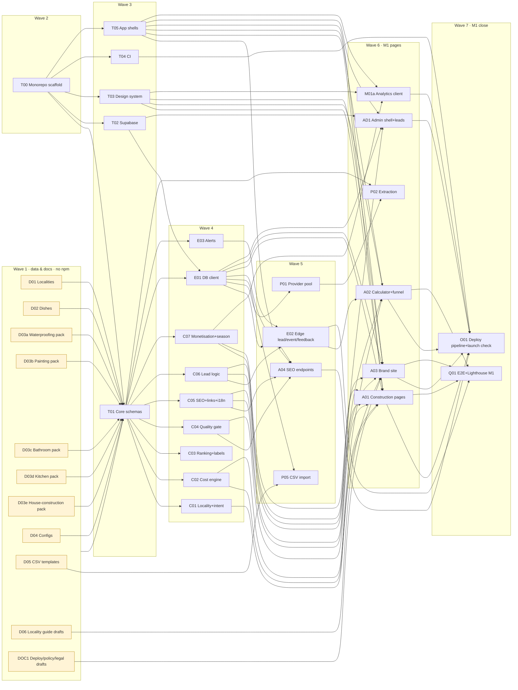

# MarketMind AI: Task Graph for Parallel Sub-agent Development

Implements [`PLAN.md`](PLAN.md) (approved) against [`CONTRACTS.md`](CONTRACTS.md).

## How to use this file

1. **Waves run in order.** Every task inside a wave can run **in parallel**, because each one owns disjoint paths and depends only on earlier waves.
2. **An agent gets exactly one task card**, plus `CONTRACTS.md` and the plan sections the card cites.
3. **An agent may edit only its own paths** (the **Owns** line). It never installs dependencies or edits contracts. It reports a missing contract or dependency instead of working around it.
4. **Done means the Acceptance commands pass.** Logic is built test-first (red, then green, then refactor). The agent finishes with a short report: files changed, tests added, open issues.
5. **The orchestrator checks between waves:** it re-runs every acceptance command, runs a cross-task review, then commits and pushes. Only then does the next wave start.
6. 🔌 = needs npm access · 🔑 = needs a real external account or key (otherwise built against mocks and fixtures) · 🧑 = needs owner input or review.

---

## Dependency graph



After M1, the later waves follow this chain (details in the cards below):

- **Wave 8 (M2):** AD1 → {AD2a, AD2b, AD2c, AD2d} ∥ M01b
- **Wave 9 (M3):** {C01, C03, C04, C05, E01, D02, T03, T05} → {F01 ∥ F02}
- **Wave 10 (M4):** {P01, P02, E02, C01, C03} → P03 ∥ {P01, P02, E01, C03, C04} → P04 → O02
- **Wave 11 (M5):** {M01b, O01} → M02 ∥ DOC2 → R01
- **Wave 12 (M6):** I01

## Wave summary

| Wave | Milestone | Tasks (parallel within the wave) | Blocked by |
|---|---|---|---|
| 1 | M1 data | D01, D02, D03a–e, D04, D05, D06, DOC1 | nothing; **can start now without npm** |
| 2 | M0 | T00 | 🔌 npm access |
| 3 | M0 | T01, T02, T03, T04, T05 | T00 (T01 also validates the Wave 1 data) |
| 4 | M0/M1 | C01–C07, E01, E03 | T01 (E01 also needs T02) |
| 5 | M1 | E02, P01, P05, A04 | Wave 4 |
| 6 | M1 | A01, A02, A03, AD1, M01a, P02 | Waves 3–5 |
| 7 | M1 gate | O01, Q01 → **owner sign-off of the launch gate** 🧑 | Wave 6 |
| 8 | M2 | AD2a, AD2b, AD2c, AD2d, M01b | AD1 |
| 9 | M3 | F01, F02 | Wave 4 + T03/T05 |
| 10 | M4 | P03, P04 → O02 | P01, P02, E02 |
| 11 | M5 | M02, DOC2 → R01 | Waves 7–10 |
| 12 | M6 | I01 | R01 · 🧑 translation review |

Waves 8, 9 and 10 do not depend on each other and can overlap once Wave 7 is green.

---

## Task cards

### Wave 1: data and docs (no npm, start now)

**D01 · Pune locality database**
- **Owns:** `data/localities.json`, `data/sources/localities.md` (research log)
- **Depends on:** CONTRACTS §4, §4a
- **Deliverables:**
  - all 20 localities, the 3 Hinjewadi phases and ≥ 8 `near-*` landmarks, each with:
    - every §4 `Locality` field, aliases (including common misspellings and Marathi/Hindi spellings) and sourced geo
    - jurisdiction (PMC/PCMC/…), pincodes, symmetric neighbours (≤ 6)
    - landmarks and clusters
  - **≥ 3 sourced `construction_facts`** for each of the 8 priority localities (Hinjewadi, Wakad, Baner, Kharadi, Hadapsar, Wagholi, Pimple Saudagar, Kothrud), covering housing stock, building age, water, rainfall and society rules
- **Rules:** every fact has a `SourceRef` you actually looked at; no unsourced claims; `status: draft`.
- **Acceptance:** valid JSON; neighbours are symmetric; every ID is in the §4a list or is a `near-*` landmark with a parent; each fact has ≥ 1 source (validated again by the T01 schema test).

**D02 · Dish catalogue**
- **Owns:** `data/dishes.json`
- **Depends on:** CONTRACTS §4, §4a
- **Deliverables:** 16 dishes plus ≤ 12 variants, each with:
  - aliases (Hinglish and Marathi/Hindi spellings, e.g. "biriyani", "misal")
  - cravings, diet, `price_bands_inr` (the UI bands for `under-*` intents) and `price_sanity_inr` (bounds that reject absurd extracted prices)
  - a 60–120-word factual description, `prose_status: draft`
- The craving map must cover "spicy" and "sweet". No price claims about specific places.
- **Acceptance:** valid JSON; IDs follow §4a; no reserved slugs.

**D03a–e · Service packs** (one agent per service: `waterproofing`, `painting`, `bathroom-renovation`, `modular-kitchen`, `house-construction`)
- **Owns:** `data/services/{id}.json`, `data/cost-models/{id}.json`, `data/sources/{id}.md`
- **Depends on:** CONTRACTS §4, §4a
- **Deliverables:**
  - a `ServiceDef` with sub-services (§4a), BHK/area presets with stated assumptions and sources, scope options, materials, duration, ≥ 6 questions to ask, ≥ 6 common mistakes, a quote checklist, and 5–8 FAQs
  - **≥ 10 cost models** (scope × material × tier), each with ≥ 2 independent sources (2025–2026 Pune or Maharashtra data preferred; national data only if labelled), component fractions, `reviewed_at`, `valid_until` (+180 days), and `status: draft`
- **Rules:** use cited ranges only, and widen the ranges if sources disagree; note any assumptions in `notes`. Never invent a source.
- **Acceptance:** valid JSON; component fractions sum to 1 ± 0.01; low ≤ expected ≤ high; every model has ≥ 2 sources from different publishers.

**D04 · Config files**
- **Owns:** `data/seasonal-calendar.json`, `data/lead-pricing.json`, `data/gate.json`, `data/ad-slots.json`, `data/experiments.json`, `data/aggregators.json`, `data/demand.csv`
- **Depends on:** CONTRACTS §4, §4a, §8, §9; plan §5, §12, §13
- **Deliverables:**
  - the seasonal calendar from plan §12, all 12 months
  - lead-pricing hypotheses from plan §13
  - gate thresholds from plan §5
  - ad-slot rules (construction lead page types off; `NEVER_ADS`)
  - one inactive experiment as an example
  - an aggregator list (Zomato, Swiggy, Justdial, Google Maps, Sulekha, Magicpin, EazyDiner, Dineout, UrbanCompany, NoBroker, Housing, 99acres, MagicBricks, IndiaMART …)
  - `demand.csv`: rows for 8 localities × services, using a prior and `source=prior`
- **Acceptance:** valid JSON/CSV; uses only §4a IDs.

**D05 · Curation CSV templates**
- **Owns:** `data/curation/*.csv`, `data/curation/README.md`
- **Depends on:** CONTRACTS §6
- **Deliverables:** the exact §6 headers, each with one clearly fake **example row marked `EXAMPLE`** (the importer skips it), plus a README for the owner explaining each column.

**D06 · Brand locality guide drafts**
- **Owns:** `content/locality-guides/{locality_id}.md`
- **Depends on:** CONTRACTS §4a; D01's research log (read-only; coordinate through sources)
- **Deliverables:** ≥ 400-word "living in / area guide" drafts for the 8 priority localities, using only sourced facts (inline citations) and frontmatter `status: draft`. They need owner review before they can be indexed.
- **Rules:** none of the food or construction page text; area-guide intent only.

**DOC1 · Deployment, policy and legal drafts**
- **Owns:** `docs/DEPLOY.md`, `docs/DATA-POLICY.md`, `docs/EDITORIAL-POLICY.md`, `content/legal/{privacy,terms,cookie-policy}.md`
- **Depends on:** plan §2, §10, §12, §13, §17, §19
- **Deliverables:**
  - **DEPLOY:** moving DNS to Cloudflare, Workers, custom domains, Access, Turnstile, KV, Email Routing, the Telegram bot, Supabase (new keys), GitHub secrets, AI Crawl Control (allow all AI bots), Search Console Domain property and its AI-features setting = Include, Bing, IndexNow, AdSense (later)
  - **The two policies** (spec §87; ranking method; corrections)
  - **Legal drafts:** the Google ads cookie wording, a DPDP notice (purpose, recipients = up to 3 contractors, retention, grievance contact), and a deletion route
- 🧑 Placeholders `{{LEGAL_NAME}}`, `{{CONTACT_EMAIL}}` and `{{GRIEVANCE_OFFICER}}` are marked for the owner.

### Wave 2: scaffold (🔌)

**T00 · Monorepo scaffold**
- **Owns:** root config (`package.json`, `pnpm-workspace.yaml`, `tsconfig*.json`, `eslint.config.js`, `.prettierrc`, `vitest.workspace.ts`, `.nvmrc`, `.gitignore`, `.editorconfig`), every `packages/*/package.json` and `apps/*/package.json`, and stub source files for every subpath export in CONTRACTS §2
- **Deliverables:**
  - **all** dependencies, pinned (verify the latest versions of astro 7.3.x, @astrojs/cloudflare 14.x, zod, vitest, wrangler, @cloudflare/vitest-pool-workers, @astrojs/check, @playwright/test, one variable font)
  - root scripts: `typecheck`, `lint`, `test`, `build`, `test:db`, `launch:check`
- **Acceptance:** `pnpm install --frozen-lockfile && pnpm -r typecheck && pnpm -r test` passes on the stubs.

### Wave 3: foundations (🔌)

**T01 · Core schemas, config and constants**
- **Owns:** `packages/core/src/schema/**`, `packages/core/src/config/**`, `packages/core/src/constants/**`
- **Depends on:** T00, CONTRACTS §3–§9
- **Deliverables:** Zod schemas for every contract shape (enums, data files, the catalogue snapshot, the `api.*` I/O, HTTP bodies, configs), the disclosure constants, and a typed config loader.
- **Acceptance:** `data/**/*.json` and the CSV headers validate in tests, **which also proves Wave 1 is correct**; a JSON-schema export test exists for the LLM-facing schemas.

**T02 · Supabase schema, functions and tests**
- **Owns:** `supabase/**`
- **Depends on:** T00, CONTRACTS §5
- **Deliverables:**
  - migrations: the `app` and `api` schemas, tables, indexes (`pg_trgm`), grants, default privileges, RLS, the observations trigger, every `api.*` function including tiered dedup in `upsert_business`, idempotent `submit_lead`, and the atomic `ask_begin` governor
  - pgTAP tests: zero privileges for anon/authenticated, allow and deny cases for each function, default privileges on a newly created table, the at-most-3-shared-assignments constraint, and the idempotency key
- **Acceptance:** `supabase db reset && supabase test db` green (using the local Supabase CLI in CI).

**T03 · Design system**
- **Owns:** `packages/ui/**`
- **Depends on:** T00; plan §15, §18
- **Deliverables:**
  - OKLCH tokens (food and construction themes; light and dark), the type scale and the self-hosted display font
  - base layouts (`BaseLayout` with a `SeoHead` slot)
  - components: Header, Footer, Breadcrumbs, Card, RecommendationCard, LabelBadge, TrustBadges, SourceNote (claim + source + date), Disclosure, AdSlot (renders nothing unless props say so; reserves min-height), WhatsAppButton, StickyActionBar (dismissible), FAQ, EmptyState, Button and Form primitives
- **Rules:** no framework; components are pure Astro with typed props; islands are not in scope.
- **Acceptance:** an Astro check passes; a visual fixture page renders every component (used by Q01); the CSS is under 25 KB; no contrast token pair is below 4.5:1 (a test computes this).

**T04 · CI**
- **Owns:** `.github/workflows/ci.yml`, `scripts/secret-scan.mjs`, `scripts/check-*.mjs` (shared build checks, filled in by O01)
- **Depends on:** T00
- **Deliverables:** CI for install, lint, typecheck, unit, Workers and database tests (Supabase CLI), building every app with `DATA_SOURCE=fixtures`, the secret scan of `dist/`, and caching.
- **Acceptance:** the workflow passes `actionlint`; the secret scan detects planted test strings.

**T05 · Astro app shells ×4**
- **Owns:** `apps/*/astro.config.mjs`, `apps/*/wrangler.jsonc`, `apps/*/src/env.d.ts`, `apps/*/public/_headers` generator script, the `apps/*/src/pages/404.astro` placeholder, `apps/admin/src/pages/index.astro` placeholder
- **Depends on:** T00, T03; CONTRACTS §10
- **Deliverables:**
  - the Cloudflare adapter (static output; `/api/*` and admin on-demand)
  - i18n config (en; mr and hi reserved)
  - a `site` per host
  - `workers_dev=false`, `preview_urls=false`, `not_found_handling: "404-page"`
  - KV, `send_email` and rate-limit bindings declared
  - `PUBLIC_LAUNCHED=false` → `X-Robots-Tag: noindex` on every response
- **Acceptance:** all four apps build; `wrangler deploy --dry-run` works for each.

### Wave 4: core logic and data access (🔌, all test-first)

| Card | Owns (`packages/…/src/`) | Deliverables | Acceptance (beyond tests passing) |
|---|---|---|---|
| **C01 Locality + intent** | `core/src/locality/**`, `core/src/intent/**` | Alias resolver (NFKC, fuzzy ≤ 2 edits), parent/child subtree, nearest-N by haversine, `parseIntent(q)` → dish/service, locality, budget, diet, open_now, craving → dishes | 100+ table-driven cases, including Hinglish and misspellings |
| **C02 Cost engine** | `core/src/cost/**` | Estimate from the model, area preset or quantity, scope, material, tier and locality factor → low/expected/high + component breakdown; preset conversions; min-job floor | Property tests: monotonic in area and tier; components sum correctly |
| **C03 Ranking + labels** | `core/src/ranking/**`, `core/src/labels/**` | `foodScore`, `providerScore` (spec weights), Bayesian shrinkage, `hotScore` bands, badges, trust labels, hidden-gem rule (plan §8) | Weights sum to 1; a label is never shown below `MIN_LABEL_EVIDENCE` |
| **C04 Quality gate** | `core/src/gate/**` | Shingle uniqueness, per-page-type thresholds, `seo_score`, hysteresis (noindex → 301), reviewed-prose rule, `GateDecision` | A fixture set of passing and failing pages; hysteresis timeline tests |
| **C05 SEO + links + i18n** | `core/src/seo/**`, `core/src/links/**`, `core/src/i18n/**` | Title, description and canonical templates (spec §38–40 + intents + sub-services), JSON-LD builders (Organization, WebSite, WebPage, BreadcrumbList, ItemList, Restaurant, LocalBusiness, Review, FAQPage), link engine (caps), `localizedUrl`, sitemap XML, `llms.txt` builder, the slug-collision checker | JSON-LD validates against schema.org shapes; no collisions across the real Wave 1 data |
| **C06 Lead logic** | `core/src/leads/**` | Phone normalisation, `leadScore` (A/B/C + qualified), dedupe key, `ctaCopy` (the "3 quotes" rule), `whatsappUrl`, ref codes, consent constants | The "3 quotes" text never appears with fewer than 3 providers; exact `wa.me` URL |
| **C07 Monetisation + season** | `core/src/monetization/**`, `core/src/season/**` | `showAd` (with `NEVER_ADS`), sponsorship date filter, experiment bucketing (per tab, deterministic), seasonal calendar resolver | Tests for all 12 months; never-ads page types |
| **E01 DB client** | `db/src/**`, `db/fixtures/**` | Typed fetch client for `api.*` (timeouts, typed errors, no supabase-js), snapshot loader with explicit `DATA_SOURCE`, a realistic fixture catalogue (fake businesses clearly named "Example …", never published) | A loader error fails the build; fixtures validate against T01 |
| **E03 Alerts** | `edge/src/alerts/**` | Telegram + email senders, message templates (lead, key disabled, dead-man, health), never throws (logs failures) | Mocked-fetch tests; message length limits |

### Wave 5: edge, providers, import and SEO endpoints (🔌)

**E02 · Edge handlers (lead, event, feedback, turnstile, visitor)**
- **Owns:** `packages/edge/src/{lead,event,feedback,turnstile,visitor}/**` and the thin `apps/*/src/pages/api/{lead,event,feedback}.ts` re-exports
- **Depends on:** E01, E03, C06
- **Deliverables:**
  - Origin check, 16 KB body limit, Turnstile siteverify, a visitor HMAC (IPv6 /64), burst limits
  - `submit_lead`, falling back to the KV outbox (202) on failure
  - alerts sent in `waitUntil`
  - batched events, gated by `EVENTS_ENABLED`
- **Acceptance:** Workers-pool tests cover a database 503 (lead queued, never lost), a duplicate idempotency key, a bad origin and a bad Turnstile token; ≤ 6 subrequests per lead.

**P01 · Provider pool and gateways** 🔑
- **Owns:** `packages/providers/**`
- **Depends on:** T01, E01
- **Deliverables:**
  - parsing of the `label:key` lists, a fingerprint per key, and a KeyStore interface (in-memory + Supabase through `api.key_report` and `api.credentials_usable`)
  - the full plan §10 error matrix, circuit breaker and budgets
  - Exa `/search`, Firecrawl `/v2/scrape` and Groq chat (strict `json_schema`, `gpt-oss-120b` → `gpt-oss-20b`), with a token estimate and cap
- **Acceptance:** one test per error-matrix row; a rotation test across 3 keys; the key never appears in logs or errors.

**P05 · CSV import CLI**
- **Owns:** `packages/pipeline/src/commands/import-csv.ts` (+ tests), `packages/pipeline/src/commands/import-reference.ts`
- **Depends on:** T01, E01, D05
- **Deliverables:** `mm import:csv <file> --dry-run|--apply`: validates every row (sources required), skips `EXAMPLE` rows, writes through `upsert_business` and creates evidence. `mm import:reference` loads `data/*.json` into the reference tables.
- **Acceptance:** dry-run diff output; a single invalid row aborts the whole file with line numbers.

**A04 · SEO endpoints (all apps)**
- **Owns:** `apps/*/src/pages/{robots.txt,sitemap.xml,sitemap-*.xml,llms.txt,ads.txt}.ts`, `apps/*/public/{indexnow-key}.txt` generation
- **Depends on:** T05, C04, C05, E01
- **Deliverables:**
  - robots that allow every AI bot (plan §12); `Disallow` only for `/api/` and `/ask/`
  - a sitemap index plus per-type sitemaps listing only indexable pages, with `lastmod` = `hash_changed_at`
  - `llms.txt`
  - `ads.txt` on main only, built from the publisher ID
- **Acceptance:** the build check finds no `noindex` URL in any sitemap.

### Wave 6: M1 pages and admin (🔌)

**A01 · Construction pages**
- **Owns:** the construction routes listed in CONTRACTS §11 as [A01], plus `apps/construction/src/components/**` except `islands/`
- **Depends on:** T03, T05, C01, C02, C04, C05, C07, E01, D01, D03
- **Deliverables:**
  - every construction page type, following the plan §5 content outline
  - a "Quick answer" block, `SourceNote`s on claims, the cost disclaimer, honest CTAs (C06), the seasonal module, the gate applied per page, and the build report rows
- **Acceptance:**
  - With the fixture catalogue: the expected page counts build; one H1 per page; canonicals correct; the gate skips thin pages.
  - With the real Wave 1 data: ≥ 10 city cost guides build, once the owner has reviewed the prose (🧑).

**A02 · Calculator and lead funnel islands**
- **Owns:** `apps/construction/src/components/islands/**`, `apps/construction/src/pages/{cost-calculator,get-quotes,for-contractors}.astro`, `packages/ui/src/islands/lead-form/**`
- **Depends on:** T03, T05, C02, C06, E02 (HTTP contract)
- **Deliverables:**
  - a vanilla-TS calculator: BHK presets with their assumptions shown, a live estimate, and "send estimate to WhatsApp"
  - a 2-step inline quote form (prefilled, consent unticked, phone validation, `keepalive` submit, idempotency key)
  - a thank-you state with the ref and a real `wa.me` link button (never an automatic redirect)
  - the `/for-contractors/` form
- **Acceptance:** < 15 KB of JavaScript per page; the form works with JavaScript disabled (falls back to a server POST); a keyboard and screen-reader pass.

**A03 · Brand site**
- **Owns:** the main routes in CONTRACTS §11 [A03], `apps/main/src/components/**`, `apps/main/public/_redirects`
- **Depends on:** T03, T05, C05, C07, E01, D06, DOC1
- **Deliverables:**
  - the home page, the gated locality guides (≥ 400 words, reviewed), legal and policy pages from DOC1, about, contact
  - the advertise, feature-your-business, featured and claim pages, whose forms use the A02 lead-form island
  - the `google-adsense-account` meta tag whenever a publisher ID is set
  - Organization + WebSite JSON-LD
- **Acceptance:** every legal page exists; no ad code anywhere on main while `ADSENSE_ENABLED=false`.

**AD1 · Admin shell, Access and leads inbox**
- **Owns:** `apps/admin/src/middleware.ts`, `apps/admin/src/pages/{index.astro,leads/**}`, `apps/admin/src/lib/**`
- **Depends on:** T02, T05, E01, C06
- **Deliverables:**
  - JWT verification (JWKS cache, `aud`, `iss`, `exp`)
  - a secret-key database client (admin only)
  - a Today screen and a leads list and detail view: status, grade, follow-up fields, assignments (masked forwarding), WhatsApp templates, CSV export, "Log WhatsApp lead", replay of the KV outbox
  - a provider list (read-only)
- **Acceptance:** tests reject forged, expired and wrong-`aud` tokens; mobile layout; no secret is sent to the client.

**M01a · Analytics client**
- **Owns:** `packages/ui/src/islands/analytics/**`
- **Depends on:** T03, T05, C07
- **Deliverables:**
  - the event beacon (batched, `sendBeacon`, a per-tab id, `ranking_run_id`/position read from data attributes)
  - the GA4 loader (on idle or interaction; eager on the thank-you state; Consent Mode v2 region defaults inline; `generate_lead`)
  - the Cloudflare Web Analytics snippet
- **Acceptance:** < 3 KB gzipped; nothing fires when `EVENTS_ENABLED=false`.

**P02 · Extraction and grounding** 🔑
- **Owns:** `packages/extract/**`
- **Depends on:** T01, P01
- **Deliverables:**
  - deterministic extractors (JSON-LD, `tel:`, ₹ prices, hours)
  - Groq normaliser prompts with JSON schemas, plus a test that each JSON schema is equivalent to its Zod schema
  - grounding (exact chunk, normalisation, value re-derived from the quote)
  - the independence rule (eTLD+1, owner group, simhash) and an aggregator discovery-only guard
  - a fixture corpus (synthetic now; ≥ 50 recorded responses once keys exist)
- **Acceptance:** the price-mismatch test fails the claim; precision ≥ 0.95 on the fixtures.

### Wave 7: M1 close (🔌)

**O01 · Deploy pipeline and launch check**
- **Owns:** `.github/workflows/deploy.yml`, `scripts/build-all.mjs`, `scripts/manifest.mjs`, `scripts/check-*.mjs` (the implementations), `scripts/launch-check.mjs`
- **Depends on:** A01, A02, A03, A04, AD1, M01a, T04
- **Deliverables:**
  - one snapshot → the gate → a cross-host manifest → build all apps → validate links, `hreflang` and every plan §20 build check → the shrinkage guard → `wrangler deploy` ×4 → IndexNow for changed hashes → write `page_builds`
  - `concurrency: deploy`
  - `launch:check` covering plan §20
- **Acceptance:** a dry run against fixtures passes; planted violations (e.g. a second H1, a `noindex` URL in a sitemap, a secret in output) each fail the run.

**Q01 · E2E and Lighthouse (M1)**
- **Owns:** `e2e/**`, `lighthouserc.json`
- **Depends on:** A01, A02, A03, E02
- **Deliverables:**
  - Playwright tests:
    - calculator → quote → thank-you, with the exact `wa.me` URL
    - a lead that survives a database 503
    - keyboard-only navigation
  - Lighthouse CI on one page per type (mobile budgets)
- **Acceptance:** green in CI.
- **Gate:** the M1 checkpoint is reached when the orchestrator review passes and the owner signs off (🧑). Only then are DNS and indexing turned on.

### Wave 8: M2 admin (parallel)

| Card | Owns (`apps/admin/src/pages/`) | Deliverables |
|---|---|---|
| **AD2a Catalogue** | `places/**`, `experiences/**`, `lib/photos/**` | Place, dish and price CRUD with source or "visited"; experiences with dish ratings and tags; client-side photo resize to WebP (≤ 1600 px + 400 px thumbnail) → Storage; duplicate warnings through the `upsert_business` preview |
| **AD2b Supply and content** | `providers/**`, `prospects/**`, `cost-models/**`, `content/**`, `queue/**` | Providers (verification method and date, sales stage), the Prospects view sorted by demand, cost-model review with expiry alerts, prose review (`prose_reviews`), the approval queue with source quotes highlighted |
| **AD2c Revenue** | `featured/**`, `sponsorships/**`, `sales/**`, `metrics/**`, `reports/**` (+ extends `leads/**` with revenue fields) | Featured listings, sponsorship campaigns, sales quotes with win-rate, the spec §81 metrics per vertical per week, revenue per 1,000 sessions by landing page, per-business 30-day report + "copy WhatsApp summary" |
| **AD2d Ops** | `publish/**`, `health/**`, `api/**` | "Rebuild now" (`workflow_dispatch`), the gate report viewer, shrinkage override, key health by fingerprint and label, budgets, jobs, database size |

**M01b · Sponsorship and ad-slot rendering**
- **Owns:** `packages/ui/src/components/AdSlot/**` (the wiring), `packages/ui/src/islands/slot-expiry/**`
- **Depends on:** T03, C07, E01
- **Deliverables:** sponsorship rendering under `DIRECT_SPONSORSHIPS_ENABLED` (labelled, `rel="sponsored"`); client-side expiry by `data-end`; AdSense units only when `ADSENSE_ENABLED`.

### Wave 9: M3 food (parallel)

**F01 · Food pages**
- **Owns:** the food routes in CONTRACTS §11 [F01] and `apps/food/src/components/**` except `islands/`
- **Depends on:** C01, C03, C04, C05, E01, D02, T03, T05
- **Deliverables:**
  - the craving home page, What's Hot, Food Pulse, and the gated dish, locality and intent pages
  - place profiles with experiences, photos, `SourceNote`s and trust labels
  - Featured blocks kept separate from the organic ranking
  - `ranking_run_id`/position stamped on every recommendation

**F02 · Food islands**
- **Owns:** `apps/food/src/components/islands/**`, `apps/food/src/pages/ask.astro`
- **Depends on:** T03, T05, C01, E02, P03 (HTTP contract only)
- **Deliverables:** Open-now (IST, computed in the browser) and Near-me (opt-in geolocation, computed in the browser) filters; the Ask UI (instant database answer + polling for the live answer + citations); the feedback widget.

### Wave 10: M4 pipeline and live Ask

**P03 · Live Ask handler** 🔑
- **Owns:** `packages/edge/src/ask/**`, `apps/{food,construction}/src/pages/api/ask*.ts`
- **Depends on:** E01, E02, P01, P02, C01, C03
- **Deliverables:** the plan §9 flow: Cache API, `ask_begin`, `waitUntil` for the live phase, coalescing, the 50/day cap and the polling result endpoint.
- **Acceptance:** ≤ 20 subrequests on the worst error path (Workers-pool counter); CPU per lookup measured and logged.

**P04 · Nightly pipeline stages** 🔑
- **Owns:** `packages/pipeline/src/stages/**`, `packages/pipeline/src/commands/{discover,refresh,extract,normalise,rank,gsc,indexnow,backup,health}.ts`
- **Depends on:** P01, P02, E01, C03, C04, E03
- **Deliverables:**
  - the plan §19 stages, idempotent through `jobs`, with a demand × value × freshness work queue (spec §56)
  - the Search Console import
  - `supabase db dump` through the pooler, encrypted with `age` and uploaded as an artifact
  - the health report
- **Acceptance:** a full dry run on fixtures; every stage can be re-run safely.

**O02 · Scheduling, dead-man and backups**
- **Owns:** `.github/workflows/nightly.yml`, `apps/admin/src/scheduled.ts`
- **Depends on:** P04, AD1, E03
- **Deliverables:** a Cloudflare Cron Trigger (01:0x IST + jitter) → `workflow_dispatch`; staged jobs with concurrency; a dead-man check (26 h); a monthly restore test.

### Wave 11: M5 hardening

**M02 · Monetisation hardening**
- **Owns:** `packages/ui/src/islands/experiments/**`, `docs/ADSENSE.md`
- **Depends on:** M01b, O01
- **Deliverables:**
  - the experiment client and its guardrail report
  - an AdSense readiness checklist (spec §103 criteria), the competitor-blocking list and the CMP setup
  - a Lighthouse run with `data-adtest="on"`

**DOC2 · Final docs**
- **Owns:** `README.md`, `docs/ARCHITECTURE.md`, `docs/RUNBOOK.md`
- **Depends on:** all earlier waves
- **Deliverables:** setup, commands, architecture diagrams, runbooks (outbox replay, key disabled, Supabase paused, restore, launch, upgrade points).

**R01 · Final independent review**
- **Owns:** `docs/reviews/**`
- **Depends on:** M02, DOC2
- **Deliverables:** a multi-lens review (correctness, security, SEO policy, accessibility, performance, spec coverage) with findings fixed by the owning tasks. This prepares the work for the external Codex/Grok review.

### Wave 12: M6

**I01 · Marathi + Hindi**
- **Owns:** `packages/core/src/i18n/messages/{mr,hi}.json`, `*_i18n` content
- **Depends on:** R01
- **Deliverables:** translated UI strings and top-page content; pages ship `noindex` until reviewed (🧑); `hreflang` only between pairs where both pages are indexable; a reciprocity test.

---

## Critical path

To reach the M1 revenue launch as fast as possible:

```
npm access → T00 → T01 → C02/C04/C05 → A01 → O01 → launch-gate sign-off
     (Wave 1 data runs in parallel now, so it is never on the critical path)
```
